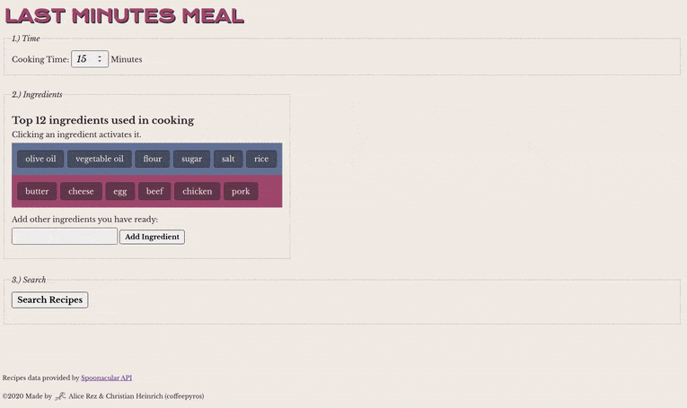
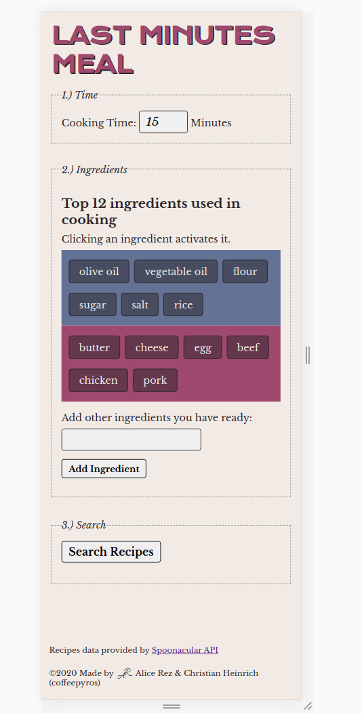
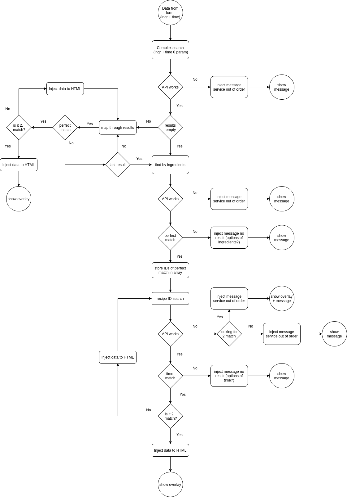

 <h1> </h1>

## Description

Collaboration with [Christian Heinrich (coffeepyros)](https://github.com/coffeepyros)

**Insert ingredients and time you have and see, what you can make with it.**



Search Recipe application targeted at busy people working/learning from home in the time of Covid-19, which have to be able prepare lunch in limited time (during lunch break) with just ingredients that they have already at home. These people need a quick possibility to find a recipe that will work with their ingredients and time.

Our application is offering to you just recipes with the perfect match - recipes, that use just the ingredients that were selected. To make search really quick, just first few recipes will be displayed by default. In future, there will be implemented also possibility to display more recipes if the user is not satisfied with initial results.

We have autocomplete function on ingredients input - just by typing few letters, you have possibility to choose ingredient that is definitely on the API list of ingredients. No more problems with typos!

We are also planning to add offering of the more ingredients and time, when the search is unsuccessful and no recipes are found. Because maybe you searched for not correct ingredient (vegetable oil/oil/olive oil etc.).

## Setup Instructions



Application uses API key, therefore there is no possibility to make live demo for it. If you are interested and want to try it, just follow these steps:

1. Clone this repository to your computer
2. Inside of the local created repository, run:
   ```
   npm install
   ```
   to install all of the necessary dependencies
3. Get your own API key from [Spoonacular API](https://spoonacular.com/food-api)
4. In the `src/script` folder create new file with name `config.js`
5. Insert your own API key in the `config.js` :
   ```javascript
   export const apiKey = "<here-comes-your-own-API-key>";
   ```
6. Adjust the number of the initially displayed recipes in variable `minimum` at the beginning of the `src/backEnd.js` file (line 10) - default value is 2
7. If you want to test functionality, try these proven combinations:
   ```
   60 minutes + flour,sugar,butter,eggs,chocolate
   20 minutes + flour,sugar,eggs,milk,oil
   60 minutes + milk, butter, potatoes
   ```
8. Enjoy usage of our application 😉

If you think, that the list of ingredients of the API (that is used for autocomplete function) could be changed, just download new list in csv formate from [Spoonacular's list of ingredients](https://spoonacular.com/food-api/docs#List-of-Ingredients) and use our converting script `src/top1kconvert.js` for Node.js to convert ingredients list to JSON formate. Just open your terminal with the path to your local repository and run commands:

```
cd src
node top1kconvert.js
```

## Implementation details

Application uses [Spoonacular API](https://spoonacular.com/food-api) - we use free account, so the number of requests is limited (it is cca 100 per day, one search cost usually at least 4 requests)

**Used technologies**: Vanilla JS, DOM, Jquery, Handlebars, Axios, asynchronous Javascript (fetch), API, JS modules, HTML, CSS, CSS variables

### Contributors:

**Alice** - API calling & displaying results, connecting everything together, creating README & materials (documentation)

**Christian (coffeepyros)** - Form creating and js functionality connected with it, autocomplete realization, styling, main idea of function

### Basic function



- top 12 ingredients is injected in the html at its loading through `renderCheckboxes.js`
- autocomplete of the ingredients input is driven by `autocomplete.js`, list of ingredients used for autocomplete can be found in `top-1k-ingredients.js`
- chosen ingredients are collected in one string divided by comma
- ingredients string together with number output of the time are collected in one object:
  ```
  {
     time: number,
     ingredients: string,
  }
  ```
- clicking on the search button, this object is pass to the `backEnd.js`, where the calling of API is happening
- API itself is called in three stages (see flowchart of the API call at right, example for `minimum = 2`):

  1.  **Complex search using time and ingredients**

      - this search is giving as a result array of all recipes it founds that corresponds to the search
      - if we are lucky and match happens in this state, we get all recipes in one call
      - problem is, that this search is quite tricky and do not work for some ingredients (for example flour)
      - so we can not rely just on it
      - if it is successful, it checks if the recipe is perfect match (has 0 missed ingredients) and if it is true, inject the results to HTML and when there is minimum nr. of results injected, it displays the whole overlay with recipes found
      - if not, the next step of the search will be called

  2.  **Ingredients search**

      - this search finds really all of the recipes with searched ingredients
      - gives just basic info about recipes - ID, title, used ingredients/missed ingredients etc....
      - no info about time need for recipe preparation and no instructions details
      - if this search is not successful, there are no recipes with these ingredients => display message for user than no results found
      - if it is successful, the recipes are filtered according to number of missed ingredients 8we want perfect match with 0 missed ingredients) and the IDs are stored in one array
      - this array with IDs is passed to the last stage of search

  3.  **Recipe ID search**

      - in this stage, recipes are searched one after other - this search is giving just information about the one recipe
      - it gives all infos
      - but a lot of calls is necessary
      - the recipes are filtered according to maximal preparation time (to match the input data from form)
      - if there is match, the recipe is injected in the HTML
      - if there is minimal number of matches (default two), the search does not continue 8to save API calls) and the overlay with results is displayed
      - when no result is achieved, error message is displayed to user (no results found)

- recipes and error messages are injected to HTML using handlebars templates
- messages are placed all in one object in `messages.js` file - there are also messages for the case API does not work
- also in the cases, when API stopped working in the half of stage 3 of recipe searching (because limit of requests was reached), if some results were still achieved, they shall be displayed.
